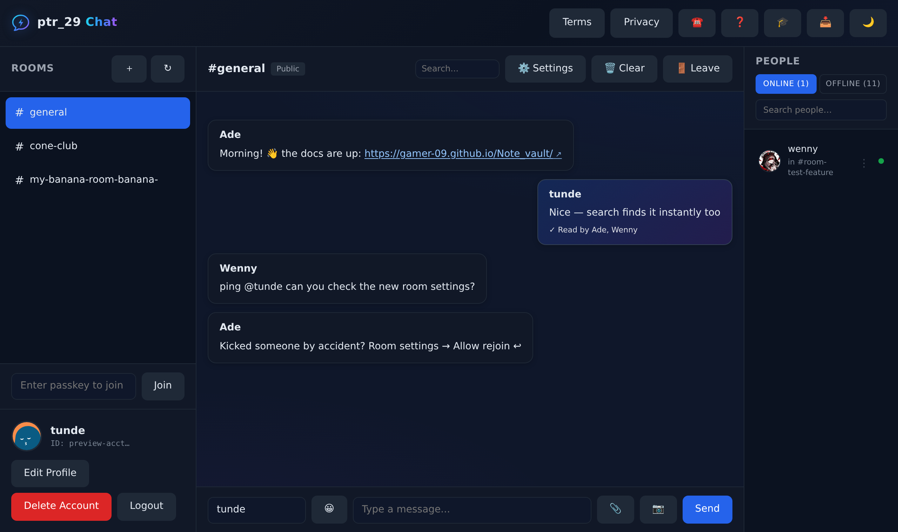

> ### 🌐 [Open Chat Site →](https://gamer-09.github.io/chat-site/)



# Chat Site


A real-time multi-room chat app. The deployed site runs on GitHub Pages + Supabase; the repo also includes the original Node.js/Express/Socket.io server for self-hosting. Access requires an account (login/register gate) and a 13+ age confirmation; existing accounts created before the age gate are prompted once to confirm. Your username, rooms and content follow the account across devices.

---

## Features

| Feature | Details |
|---|---|
| Real-time messaging | Instant delivery via WebSocket (Socket.io) |
| Multiple rooms | Join existing rooms or create your own |
| Private rooms | Lock any room with a passkey |
| Image sharing | Upload and send allow-listed images up to 5 MB; other safe document types up to 10 MB |
| Typing indicators | See when others are typing |
| Edit & delete | Edit or delete your own messages within the time window |
| Read receipts | See who has read each message |
| User presence | Online = tab open, offline = tab closed; presence pruned when stale |
| People panel | Online/Offline toggle with live counts, **search filter**, last-seen times |
| Member profiles | Online-list ⋮ menu → personal card (avatar, status, activity stats); view-only entry point |
| Client-ID requests | Consent-based: reasoned request → recipient approves/denies in the 📥 Inbox; approval shares a snapshot and can later be stopped/revoked |
| Guided tour | 🎓 watch-only demo: fake volunteers Nova & Rex; guide demonstrates room controls, safe links, Client-ID Inbox basics, and temporary demo rooms auto-delete |
| Username rules | "Anonymous" reserved; abandoned/orphan names auto-reclaimable; active names protected |
| Full wipes | Rename fully erases the old name's messages/reactions/receipts; **Delete Account** (password-verified) erases account + user + all content + owned rooms; operator `purge_user()` for any name |
| Reactions | Instant hover tooltip with names ("you" for self), correct own-detection, toggle semantics |
| Accounts | 🔐 Login/register gate before app access; 13+ age confirmation for new and legacy accounts; bcrypt+pepper hashed passwords (SHA-256 on-device first); hashes unreadable via API; 5-try rate limit; logout button; Delete Account = full erase |
| Unique usernames | Server enforces no two users share the same name |
| Auto avatars | DiceBear avatars generated from your username, or supply your own URL |
| Admin tools | Rename, clear, delete, transfer ownership, manage admins and users |
| Inbox | Received + sent Client-ID requests, realtime badge/popup notifications, approval/denial status, and Stop sharing controls |
| Guided tour | 🎓 Manual live walkthrough from the 🎓 button or Help replay; creates temporary demo rooms only when started and deletes them when finished |
| Themes | 🌙/☀️ dark-light toggle, remembered per browser |
| Resilience | Self-hosted Supabase lib, versioned assets, network-first service worker |
| Built-in help | Slide-by-slide help guide accessible from the toolbar |
| Mobile layout | Responsive design with a dedicated mobile sidebar |
| PWA | Service worker included for offline caching |
| Safe links | Plain and Markdown-style http/https links are clickable after validation; unsafe protocols, private/local links, credential-obfuscated links, punycode look-alikes, risky downloads, and link spam are blocked. This is allow-list validation, not a full malware scan of the remote site. |
| Docker ready | `Dockerfile` included for container deployments |

---

## Project Structure

```
Chatting_updated/
├── server.js            # Express + Socket.io server — entry point
├── package.json
├── Dockerfile
├── Procfile             # For Heroku-style platforms
├── data/
│   ├── store.js         # JSON data layer (rooms, messages, users)
│   └── db.json          # Persistent store — auto-created on first run
├── public/
│   ├── index.html       # Main chat UI
│   ├── client.js        # Frontend Socket.io logic
│   ├── mobile.css       # Mobile styles
│   └── sw.js            # Service worker
└── uploads/             # Uploaded images — auto-created on first run
```

---

## Requirements

- Node.js 18 or newer (20 recommended)
- npm 8 or newer

---

## Running Locally

```bash
cd Chatting_updated
npm install
npm start
```

Open `http://localhost:3000` in your browser.

For development with auto-reload:

```bash
npm run dev
```

### Environment variables

| Variable | Default | Description |
|---|---|---|
| `PORT` | `3000` | Port the server listens on |
| `HOST` | `127.0.0.1` | Interface to bind to |
| `ADMIN_TOKEN` | unset | Required token for destructive server admin endpoints (`/api/clear-all`, `/api/admins/prune`, `/admin/shutdown`). If unset, those endpoints are disabled. |
| `ALLOWED_ORIGINS` | same-origin only | Comma-separated extra origins/hosts allowed to call the API/socket server. |
| `UPLOAD_SECRET` | random per boot | Secret used to sign self-hosted upload URLs; set a fixed strong value in production. |
| `MAX_IMAGE_BYTES` | `5242880` | Self-hosted image upload limit. |
| `MAX_FILE_BYTES` | `10485760` | Self-hosted non-image file upload limit. |

> Set `HOST=0.0.0.0` when running on a VPS or inside Docker so the server is reachable from outside.

### Supabase security migrations

For the GitHub Pages + Supabase deployment, run the SQL files in `supabase/` in order. The current security/legal sequence is:

```text
011_security_hardening.sql
012_safe_links.sql
013_inbox_badge_fix.sql
014_stop_client_id_sharing.sql
015_age_gate_signup.sql
016_existing_account_age_verification.sql
017_legacy_age_login_fix.sql
018_terms_acceptance_signup.sql
019_markdown_safe_links.sql
020_safe_link_regex_fix.sql
```

`011_security_hardening.sql` enforces account-session binding, stricter RLS, upload type/size limits, and safer message payload checks on the server side. Then run `supabase/012_safe_links.sql` to enforce safe-link validation in Supabase too. Run `supabase/013_inbox_badge_fix.sql` to enable realtime inbox badge updates, `supabase/014_stop_client_id_sharing.sql` to allow approved Client-ID sharing to be stopped, then `supabase/015_age_gate_signup.sql` to enforce the 13+ signup gate server-side, then `supabase/016_existing_account_age_verification.sql` so existing accounts are prompted and can store their confirmation, then `supabase/017_legacy_age_login_fix.sql` so legacy sessions that predate account sessions are forced through fresh login/verification instead of being skipped, then `supabase/018_terms_acceptance_signup.sql` so Terms acceptance is stored and enforced server-side at signup, then `supabase/019_markdown_safe_links.sql` so Markdown-style pasted links are parsed safely instead of rejected incorrectly, then `supabase/020_safe_link_regex_fix.sql` to correct the PostgreSQL regex used by the RLS safe-link check.

---

## Docker

```bash
cd Chatting_updated

# Build
docker build -t chat-site .

# Run
docker run -p 3000:3000 -e HOST=0.0.0.0 chat-site
```

To keep messages and uploads after the container restarts:

```bash
docker run -p 3000:3000 -e HOST=0.0.0.0 \
  -v "$(pwd)/data:/app/data" \
  -v "$(pwd)/uploads:/app/uploads" \
  chat-site
```

---

## Deploying to a VPS

```bash
# 1. SSH into your server and clone
git clone https://github.com/gamer-09/chat-site.git
cd chat-site/Chatting_updated

# 2. Install dependencies
npm install --omit=dev

# 3. Start with PM2 so it survives reboots
npm install -g pm2
HOST=0.0.0.0 PORT=3000 pm2 start server.js --name chat-site
pm2 save
pm2 startup   # copy and run the command it prints
```

Then open port 3000 in your firewall, or put Nginx or Caddy in front on port 80/443 with HTTPS.

### Updating from GitHub

```bash
cd chat-site/Chatting_updated
git pull --ff-only
npm install --omit=dev
pm2 restart chat-site
```

---

## Deploying to Railway / Render / Heroku

The `Procfile` is already configured:

```
web: node server.js
```

Set `HOST=0.0.0.0` in your hosting dashboard's environment variables. `PORT` is set automatically by most platforms.

---

## How to Use

### Joining a room

1. Enter a **username** in the sidebar — minimum 2 characters, must be unique across all connected users.
2. Click a room from the list, or click **+ New Room** to create one.
3. Click **Join**.

### Sending a message

- Type in the message box and press **Enter** or click **Send**.
- Click the image icon to attach and send a JPG/PNG/GIF/WebP photo (max 5 MB).
- Click the file icon to attach an allow-listed file (PDF, TXT, CSV, JSON, DOCX, XLSX, PPTX; max 10 MB).

### Sending links

The chat accepts normal links and Markdown-style pasted links, for example:

```text
https://www.youtube.com/@WhiteWanderer-j4w
[https://gamer-09.github.io/Note_vault/](https://gamer-09.github.io/Note_vault/)
[My site](https://gamer-09.github.io/Note_vault/)
```

Before a message is saved, the browser and Supabase RLS check the link. The app allows only regular `http://` and `https://` links, then blocks unsafe protocols, localhost/private-network targets, links with embedded usernames/passwords, punycode look-alike domains, risky executable/script downloads, and messages with too many links. This is a validation/allow-list check; it does **not** guarantee the destination site is malware-free.

### Creating a room

1. Click **+ New Room**.
2. Enter a room name (letters, numbers, hyphens, underscores — max 50 characters).
3. Toggle **Private** if you want to restrict access, then set a passkey.
4. Click **Create**.

### Joining a private room

Click the room name and enter the passkey when prompted. The passkey is checked against the server — it is not stored in your browser.

### Editing or deleting messages

Hover over one of your own messages and click the **edit** or **delete** icon. Editing is only available within the time window set by the server.

### Admin actions (room owner)

Room owners have a settings panel with:

- Rename the room
- Clear all messages
- Delete the room
- Transfer ownership to another user
- Add or remove admins and members

---

## API Reference

### HTTP endpoints

| Method | Path | Description |
|---|---|---|
| `GET` | `/health` | Health check — returns `{ status: "ok" }` |
| `GET` | `/api/rooms` | List all rooms |
| `POST` | `/api/rooms` | Create a room |
| `GET` | `/api/rooms/:room/messages?clientId=&limit=` | Fetch message history |
| `POST` | `/api/rooms/:room/images` | Upload an image |

### WebSocket events (client → server)

| Event | Payload | Description |
|---|---|---|
| `join` | `{ room, username, avatar, clientId }` | Enter a room |
| `message` | `{ room, text, clientId }` | Send a text message |
| `typing` | `{ isTyping }` | Broadcast typing state |
| `update-profile` | `{ room, clientId, username, avatar }` | Change display name or avatar |
| `check-username` | `{ username }` | Check if a username is available |
| `edit-message` | `{ room, id, text, clientId }` | Edit a sent message |
| `delete-message` | `{ room, id, clientId }` | Delete a message |
| `list-users` | — | Request list of all users |

### WebSocket events (server → client)

`message`, `presence`, `system`, `typing`, `users`, `receipt`, `room-renamed`, `room-deleted`

---

## Data Storage

All data is written to `data/db.json` — a plain JSON file, no database server needed. Back this file up regularly if message history matters.

For high-traffic deployments, replace the read/write calls in `data/store.js` with a proper database (PostgreSQL, SQLite, MongoDB, etc.).

---

## Operator contact

Official operator channels:

- WhatsApp: [+234 902 378 5212](https://wa.me/2349023785212)
- Instagram: [@not_udo2025](https://www.instagram.com/not_udo2025/)
- YouTube: [@WhiteWanderer-j4w](https://www.youtube.com/@WhiteWanderer-j4w)
- GitHub: [gamer-09](https://github.com/gamer-09)

Do not send passwords, room passkeys, or unnecessary sensitive information through contact channels.

---

## Legal & Safety

Running a public chat platform makes you the operator. These steps protect you:

### Included Terms and Privacy pages

The app already includes `public/terms.html` (Terms of Service / Terms of Use) and `public/privacy.html`, linked from the header, Contact modal, and Help guide. They now describe the 13+ age requirement, account gates, uploads, safe links, Client-ID requests/Stop sharing, account deletion, private-room limits, and operator contact.

### Remaining operator responsibilities

- Keep an abuse/security contact visible and monitored.
- Run the Supabase migrations in order, especially the age-gate and security migrations.
- Use HTTPS in production; never expose the chat over plain HTTP.
- Keep `.env`, `data/db.json`, runtime logs, and user uploads out of GitHub.
- If you later add email marketing, payments/subscriptions, analytics, ads, Google Fonts, or session replay, update the Terms/Privacy before launch.

## Database migrations (Supabase SQL Editor)

| File | Purpose |
|---|---|
| `Chatting_updated/supabase/schema.sql` | Base schema (rooms, messages, presence, receipts, reactions, room RPCs) |
| `supabase/001_id_requests.sql` | Client-ID request inbox table + participant-only RLS |
| `supabase/002_rls_fix.sql` | Own-message edit/delete by any of your identities; reactions sender-only |
| `supabase/004_username_available.sql` | One-call availability check + orphan reclaim |
| `supabase/005_reserve_anonymous.sql` | Reserves "anonymous" |
| `supabase/007…/008_backfill…sql` | Backfill user rows from every activity source |
| *(inline in chat)* | `purge_user(name)` — full operator purge of a username |
| `supabase/009_accounts.sql` | Hardened accounts: no client-facing table policies, peppered bcrypt, rate limiting, anti-enumeration |
| `supabase/010_delete_account.sql` | `delete_account(acct, pass)` — password-verified SECURITY DEFINER full erase |
| `supabase/011_security_hardening.sql` | Account-session binding, stricter RLS, upload type/size limits |
| `supabase/012_safe_links.sql` | Safe-link validation for messages and edits |
| `supabase/013_inbox_badge_fix.sql` | Realtime inbox badge updates + case-insensitive request matching |
| `supabase/014_stop_client_id_sharing.sql` | Allows approved Client-ID sharing to be revoked/stopped |
| `supabase/015_age_gate_signup.sql` | Requires explicit 13+ age confirmation for account registration |
| `supabase/016_existing_account_age_verification.sql` | Prompts/stores 13+ confirmation for existing accounts |
| `supabase/017_legacy_age_login_fix.sql` | Fixes legacy account sessions so age verification cannot be skipped |
| `supabase/018_terms_acceptance_signup.sql` | Requires explicit Terms/Privacy acceptance for account registration |
| `supabase/019_markdown_safe_links.sql` | Fixes safe-link parsing for Markdown-style pasted links |
| `supabase/020_safe_link_regex_fix.sql` | Corrects Supabase RLS regex so normal safe links are not rejected |
